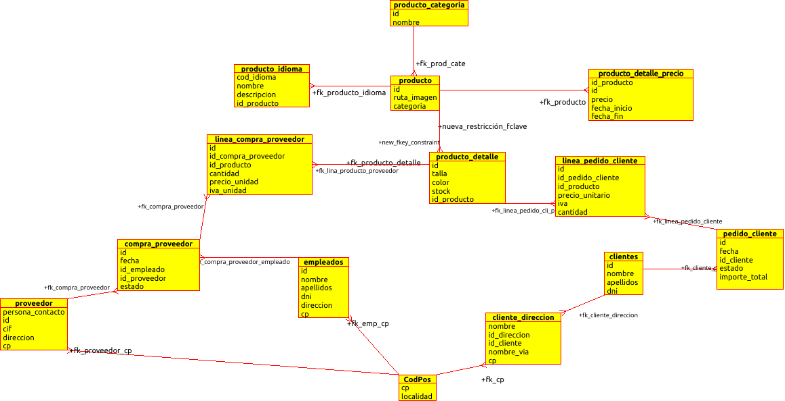
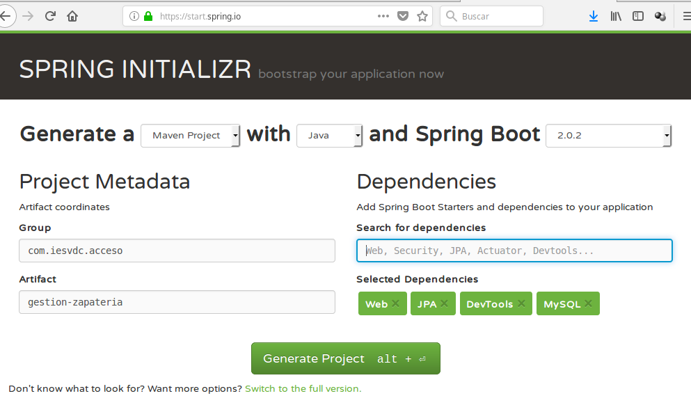
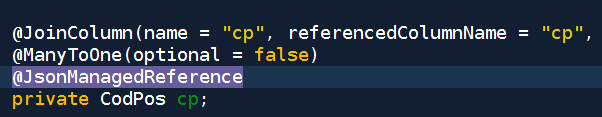
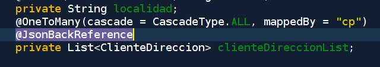

# Proyecto Zapateria

Ejercicio: implementar como servicio REST un CRUD con Spring contra una base
de datos MariaDB. 

Prueba de concepto para demostrar cómo crear con anotaciones @Autowiring
un servicio REST con Spring e Hibernate.

También veremos cómo solucionar el problema que el JSON generado sea 
recursivo (entidades que referencian a entidades).

## Paso 1: Crear la Base de Datos

Instalamos MySQL o MariaDB como servicios o bien usamos un contenedor docker.

### Creación con Docker del contenedor

Usamos la configuración que [nos explican en la Web oficial](https://hub.docker.com/_/mariadb).

Creamos el fichero stack.yml:

```yaml
# Use root/example as user/password credentials
version: '3.1'

services:

  db:
    image: mariadb
    restart: always
    ports:
      - 33306:3306
    environment:
      MYSQL_ROOT_PASSWORD: example

  adminer:
    image: adminer
    restart: always
    ports:
      - 8081:8080

```

Lanzamos el contenedor:

```bash
 $ sudo docker-compose -f stack.yml up
```

Creamos la BBDD "zapateria" desde línea de comandos, desde el IDE o desde PHPmyadmin.

## Paso 2: Conectar desde NetBeans o STS a la BBDD (crear la conexión)

Con Netbeans, pestaña "Servicios", botón derecho en "Databases" y creamos una 
nueva conexión. 

Si usamos MariaDB, tendremos que descargarnos el 
[Conector Java desde su Web](https://mariadb.com/kb/en/library/about-mariadb-connector-j/).

En cadena de conexión ponemos: **jdbc:mariadb://localhost:3306/database** para 
forzar el driver MariaDB.

Una vez conectados, creamos las tablas e introducimos los datos:

```sql
DROP TABLE IF EXISTS cliente_direccion;
DROP TABLE IF EXISTS cliente;
DROP TABLE IF EXISTS cod_pos;
--
-- TABLE: cod_pos
--
--
CREATE TABLE cod_pos (
  cp INT PRIMARY KEY,
  localidad VARCHAR(120) NOT NULL
);
--
-- TABLE: clientes
--
--
CREATE TABLE cliente (
  id INT AUTO_INCREMENT PRIMARY KEY,
  nombre VARCHAR(40) NOT NULL ,
  apellidos VARCHAR(100) NOT NULL ,
  dni INT NOT NULL
);
--
-- TABLE: cliente_direccion
--
--
CREATE TABLE cliente_direccion (
  id_direccion INT AUTO_INCREMENT PRIMARY KEY,
  nombre VARCHAR(100),
  id_cliente int REFERENCES cliente(id) ON UPDATE CASCADE ON DELETE CASCADE,
  nombre_via VARCHAR(150) NOT NULL ,
  cp int REFERENCES cod_pos(cp) ON UPDATE CASCADE ON DELETE SET NULL
);
INSERT INTO `cliente` (`id`, `nombre`, `apellidos`, `dni`) VALUES
(1, 'Pepe', 'Perez Martinez', 12345678),
(2, 'Miguel Angel', 'Gutierrez Garcia', 87654321)
(3, 'Juan', 'Sin Miedo', 11223344);
INSERT INTO `cod_pos` (`cp`, `localidad`) VALUES
(23005, 'Jaén'),
(23008, 'Jaén'),
(29000, 'Málaga');
INSERT INTO `cliente_direccion` (`nombre`, `id_direccion`, `id_cliente`, `nombre_via`, `cp`) VALUES
('Mi casa', 1, 1, 'Paseo de la Estación 44', 23008),
('Casa', 2, 2, 'Rue del Percebe 13', 23005),
('Playa', 3, 2, 'Rue del Percebe 13', 29000),
('Oficina', 1, 3, 'Avenida de Andalucia S/N', 29000);
```
Recuerda que el diagrama ER que estamos usando en clase es éste:


### Paso 3: Creamos el proyecto

#### Usando este repo
Clonamos este repositorio y configuramos la conexión modificando
"src/main/resources/application.properties" con nuestro usuario y contraseña:

```java
spring.datasource.url = jdbc:mariadb://localhost:3306/database
spring.datasource.username = username
spring.datasource.password = password
spring.jpa.properties.hibernate.dialect = org.hibernate.dialect.MariaDBDialect
spring.jpa.hibernate.ddl-auto = update
```

#### Creando el proyecto desde cero: 

Visitar la página [Spring Initializr](start.spring.io) y creamos un proyecto.



### Paso 4: Generar las entidades nuevas desde la BBDD

Botón derecho en el proyecto, "new" -> "Entities from Database":


Tenemos que estar conectados a la base de datos para poder generar las clases entidad.

### Paso 5: Modificar las clases entidad para evitar referencias recursivas en JSON

Modificando la aplicación Spring: para conseguir que se genere JSON donde unas
entidades aniden a otras, tenemos que añadir **@EnableJpaRepositories(considerNestedRepositories = true)**
a nuestra aplicación.

```java
package com.iesvdc.acceso.zapateria.gestionzapateria;

import org.springframework.boot.SpringApplication;
import org.springframework.boot.autoconfigure.SpringBootApplication;
import org.springframework.data.jpa.repository.config.EnableJpaRepositories;

@EnableJpaRepositories(considerNestedRepositories = true)
@SpringBootApplication
public class GestionZapateriaApplication {

	public static void main(String[] args) {
		SpringApplication.run(GestionZapateriaApplication.class, args);
	}
}
```



### Paso 6: Crear las interfaces de los distintos repositorios

Para cada uno de nuestras clases entidad, tenemos que generar las interfaces para los repositorios así:

**Fichero RepositorioClientes.java**
```java
import org.springframework.data.jpa.repository.JpaRepository;
import org.springframework.stereotype.Repository;

@Repository
public interface RepositorioClientes extends JpaRepository<Cliente, Long> {
    
}
```

Gracias al **"autowiring"** de Spring, automáticamente estarán disponibles 
las consultas predefidas en Cliente (findById, findAll, findByNombre, findByApellidos....):

**Fichero Cliente.java**


```java
@Entity
@XmlRootElement
@NamedQueries({
    @NamedQuery(name = "Cliente.findAll", query = "SELECT c FROM Cliente c")
    , @NamedQuery(name = "Cliente.findById", query = "SELECT c FROM Cliente c WHERE c.id = :id")
    , @NamedQuery(name = "Cliente.findByNombre", query = "SELECT c FROM Cliente c WHERE c.nombre = :nombre")
    , @NamedQuery(name = "Cliente.findByApellidos", query = "SELECT c FROM Cliente c WHERE c.apellidos = :apellidos")
    , @NamedQuery(name = "Cliente.findByDni", query = "SELECT c FROM Cliente c WHERE c.dni = :dni")})
public class Cliente implements Serializable {

    private static final long serialVersionUID = 1L;
    @Id
    @GeneratedValue(strategy = GenerationType.IDENTITY)
    @Basic(optional = false)
    @Column(nullable = false)
    private Integer id;
    @Basic(optional = false)
    @Column(nullable = false, length = 40)
    private String nombre;
    @Basic(optional = false)
    @Column(nullable = false, length = 100)
    private String apellidos;
    @Basic(optional = false)
    @Column(nullable = false)
    private int dni;
    
    
    @OneToMany(cascade = CascadeType.ALL, mappedBy = "idCliente")
    @JsonManagedReference
    private List<ClienteDireccion> clienteDireccionList;
```

### Paso 7: Crear el controlador

Vamos a implementar las siguientes rutas y verbos HTTP:


|	Descripción 							| Verbo HTTP 	| ruta						| 
|---										|--- 			|--- 						|
| Listar todos los clientes					| GET			| /rest/cliente				|
| Ver el detalle de un cliente				| GET			| /rest/cliente/{id}		|
| Crear un nuevo cliente					| POST			| /rest/cliente				|
| Borrar un  cliente						| DELETE		| /rest/cliente/{id}		|
| Listar todos los códigos postales 		| GET			| /rest/codpos  			|
| Añadir un nuevo código postal				| POST			| /rest/codpos				|
| Listar todas las direcciones de todos los clientes | GET	| /rest/cliente/direccion	|
| Listar todas las direcciones un cliente	| GET			| /rest/cliente/{idCli}/direccion		|
| Añadir una dirección a un cliente			| POST			| /rest/cliente/{idCli}/direccion		|
| Actualizar las direcciones de un cliente 	| PUT 			| /rest/cliente/{idCli}/direccion		|
| Añadir un código postal					| POST			| /rest/codpos				|
| Listar todos los códigos postales 		| GET			| /rest/codpos				|
| Buscar la localidad de un código postal 	| GET			| /rest/codpos/{id}			|
| Actualizar la localidad de un código		| PUT			| /rest/codpos/{id}			|
| Borrar un código postal					| DELETE		| /rest/codpos/{id}			|


```java
import java.util.List;
import org.springframework.beans.factory.annotation.Autowired;
// import org.springframework.data.jpa.repository.config.EnableJpaRepositories;
import org.springframework.web.bind.annotation.GetMapping;
import org.springframework.web.bind.annotation.RequestMapping;
import org.springframework.web.bind.annotation.RestController;


@RestController
@RequestMapping("/rest")
public class Controlador {
    
    @Autowired
    RepositorioClientes repoClient;
    
    @Autowired
    RepositorioCodPos repoCodPos;
    
    @Autowired
    RepositorioDireccion repoDirec;

   // Get All Clientes
    @GetMapping("/clientes")
    public List<Cliente> getAllAlumnos() {
        return repoClient.findAll();
    }
    
    // Get All CodPos
    @GetMapping("/codpos")
    public List<CodPos> getAllCodPos() {
        return repoCodPos.findAll();
    }
    
    // Get All ClienteDireccion
    @GetMapping("/direcciones")
    public List<ClienteDireccion> getAllDirecciones() {
        return repoDirec.findAll();
    }    
}
```

### Paso 8: Probar el servicio

Desde un navegador:

http://localhost:8080/rest/clientes


Desde línea de comandos, usando los tests (cambiamos al directorio del proyecto
y escribimos):

$ mvn -Dtest=GestionZapateriaApplicationTests test


### Paso 9: Crear el cliente Web que conecte al servicio

HTML5+JS+jQuery

